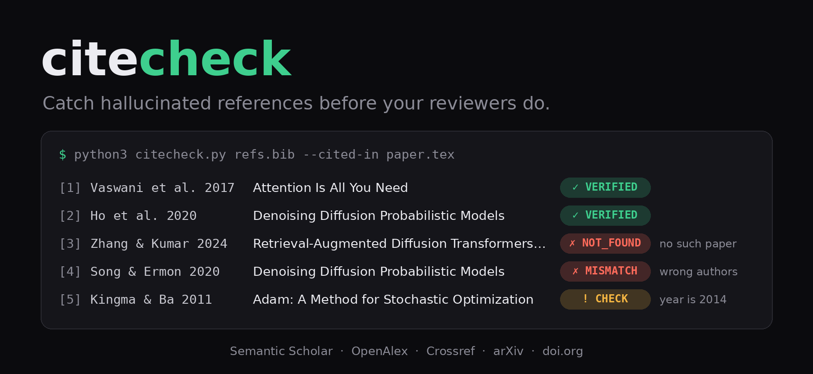

# citecheck 🔎 — Cite papers that exist.

> Catches hallucinated references before your reviewers do.

<p align="center">
  
</p>

<p align="center">
  <a href="#install"></a>
  <a href="scripts/citecheck.py"></a>
  <a href="scripts/citecheck.py"></a>
  <a href="#how-it-checks"></a>
</p>

citecheck looks up every reference your paper cites in Semantic Scholar, OpenAlex, Crossref and arXiv. It tells you which ones **don't exist**, and which have the **wrong authors, DOI, arXiv ID or year**. It ships as a Claude Code plugin and as a single Python file with no dependencies.

```console
$ python3 scripts/citecheck.py examples/refs.bib --cited-in examples/paper.tex
[1/5] VERIFIED  vaswani2017attention
[2/5] VERIFIED  ho2020denoising
[3/5] NOT_FOUND zhang2024retrieval
[4/5] MISMATCH  song2020denoising
[5/5] CHECK     kingma2011adam
citecheck 0.1.0: 5 references in examples/refs.bib
  NOT_FOUND 1   MISMATCH 1   CHECK 1   VERIFIED 2
  checking the 5 entries cited in the .tex sources

NOT_FOUND  zhang2024retrieval  "Retrieval-Augmented Diffusion Transformers for Long-Horizon Planning"
           - no work with this title in Semantic Scholar, OpenAlex, Crossref, arXiv

MISMATCH   song2020denoising  "Denoising Diffusion Probabilistic Models"
           - 2 of 2 cited authors are not on the record: Song, Yang; Ermon, Stefano
           record: "Denoising Diffusion Probabilistic Models" -- Jonathan Ho, Ajay Jain, P. Abbeel | 2020 | Neural Information Processing Systems | https://www.semanticscholar.org/paper/5c126ae3421f05768d8edd97ecd44b1364e2c99a [Semantic Scholar]

CHECK      kingma2011adam  "Adam: A Method for Stochastic Optimization"
           - cited year 2011, record year 2014
           record: "Adam: A Method for Stochastic Optimization" -- Diederik P. Kingma, Jimmy Ba | 2014 | arXiv | https://arxiv.org/abs/1412.6980 [arXiv]
```

## Why

- **Hallucinated references get papers rejected.** The NeurIPS 2026 handbook calls them a Code of Conduct violation. One NeurIPS 2026 area chair reported that 5 of the 8 submissions in their batch had two or more ([Pruthi](https://x.com/danish037/status/2089642898438693185)).
- **They survive peer review.** Among accepted 2025 papers, 5.1% at NeurIPS and 3.4% at ICML had at least two likely hallucinated references ([arXiv:2607.00738](https://arxiv.org/abs/2607.00738)).
- **They look real.** Language models reuse real authors, real venues and titles that are nearly right. "*Denoising Diffusion Probabilistic Models*, Song and Ermon, 2020" reads fine, but it is Ho, Jain and Abbeel's paper.
- **The lookup is the step nobody does.** Every index needed to check a bibliography is already public. citecheck runs the lookups for you, at about a second per reference.

## Example

You ask a language model to tighten the related-work paragraph of your draft ([`examples/paper.tex`](examples/paper.tex)). The result compiles and reads well:

> Attention-only architectures (Vaswani et al., 2017) and denoising diffusion (Ho et al., 2020) are now standard building blocks. Retrieval-augmented diffusion transformers extend both to long-horizon planning (Zhang and Kumar, 2024), and the denoising objective has been analysed through score matching (Song and Ermon, 2020). We train all models with Adam (Kingma and Ba, 2011).

Three of the five citations are wrong:

| Citation | What's wrong | Verdict |
| --- | --- | --- |
| Zhang and Kumar, *Retrieval-Augmented Diffusion Transformers for Long-Horizon Planning*, ICLR 2024 | the paper does not exist | ✗ NOT_FOUND |
| Song and Ermon, *Denoising Diffusion Probabilistic Models*, 2020 | real title, but it's by Ho, Jain and Abbeel | ✗ MISMATCH |
| Kingma and Ba, *Adam: A Method for Stochastic Optimization*, 2011 | Adam appeared in 2014 | ! CHECK |

The script catches all three (output above). In Claude Code, just ask:

> I'm submitting this to NeurIPS tomorrow. Can you check my references?

Claude runs citecheck, searches the web for anything the indexes can't place, and reports back. Here is an excerpt from a real run (53 seconds):

> **1. `zhang2024retrieval`: probably fabricated.**
> "Retrieval-Augmented Diffusion Transformers for Long-Horizon Planning" by Wei Zhang and Rahul Kumar (ICLR 2024) isn't in Semantic Scholar, OpenAlex, Crossref or arXiv. I also searched the web three ways […]. None found a paper with this title.
>
> **2. `song2020denoising`: wrong authors, and a duplicate title.**
> "Denoising Diffusion Probabilistic Models" is by Jonathan Ho, Ajay Jain and Pieter Abbeel (2020). That's the paper already in your bib as `ho2020denoising`. […]
>
> **3. `kingma2011adam`: wrong year.** The bib says 2011, but the arXiv record (1412.6980, which your entry cites) is 2014.
>
> Should I apply the Adam fix and remove `zhang2024retrieval` now? […]

It doesn't edit anything until you say so. It also won't swap a fabricated reference for some other real paper, because the sentence citing it may not hold for the substitute.

## Install

### Claude Code plugin

```
/plugin marketplace add sunami-lab/citecheck
/plugin install citecheck@citecheck
```

Then ask "check my references", or run `/citecheck:verify refs.bib`. It works on LaTeX projects and `.bib` files. It also works on PDF, Word or pasted reference lists: Claude extracts the references first, then checks them. The skill also has Claude check any reference it writes itself.

### Standalone script

```bash
git clone git@github.com:sunami-lab/citecheck.git
python3 citecheck/scripts/citecheck.py refs.bib --cited-in paper/
```

This needs Python 3.8+ and nothing else. The exit status is 1 when anything is NOT_FOUND or MISMATCH, so it drops into CI or a pre-commit hook.

## Verdicts

| | Verdict | Meaning |
| --- | --- | --- |
| ✓ | **VERIFIED** | title, authors and year agree with an indexed record |
| ! | **CHECK** | the work exists but a field differs (title wording, year, an author), or it isn't an indexed paper but its URL is live |
| ✗ | **MISMATCH** | the title exists but most cited authors aren't on it, or the DOI/arXiv ID points to a different work or to nothing |
| ✗ | **NOT_FOUND** | no index has a work with this title |
| ? | **ERROR** | too few sources answered to decide |

A source outage gives ERROR, never NOT_FOUND. NOT_FOUND requires at least two sources to have answered, including Semantic Scholar or OpenAlex.

## How it checks

1. **Identifiers first.** DOIs resolve through doi.org, and arXiv IDs through the arXiv API. citecheck finds arXiv IDs in `eprint`, `url`, `journal = {arXiv preprint arXiv:…}` and DBLP's `volume = {abs/…}`.
2. **Title search.** It queries Semantic Scholar, OpenAlex, Crossref and arXiv, and stops as soon as a record agrees on title, authors and year.
3. **Author-anchored retry.** If no record lists the cited authors, it searches OpenAlex again, restricted to the first author. That gets past same-title noise: the real *Generative Adversarial Nets* is not in any index's top five title hits.
4. **Field-by-field comparison.**
   - Titles match at a similarity of 0.95 or more. From 0.85 it counts as the same work with different wording.
   - Authors are compared by family name.
   - Years pass if the cited year is at most one year earlier or two years later than the record's, since preprints get published later.

## Options

| Flag or variable | What it does |
| --- | --- |
| `--cited-in TEX…` | check only keys cited in these `.tex` files or directories |
| `--json OUT` | write per-entry results, including the matched record |
| `--no-cache` | bypass the 7-day lookup cache in `~/.cache/citecheck/` |
| `S2_API_KEY`, `OPENALEX_API_KEY` | free API keys; the anonymous Semantic Scholar tier is often rate-limited |
| `CITECHECK_MAILTO` | an email address for the Crossref and OpenAlex polite pools |

Input can also be JSON: `[{"key", "title", "authors": [...], "year", "doi", "arxiv", "url"}]`.

## Does it work?

Tested on 26 September 2026. The samples are small, so read this as a smoke test, not a benchmark.

| Test set | Result |
| --- | --- |
| 165 cited references from three arXiv papers (DDPM, LoRA, *Phantom References*) | no false MISMATCH; 1 NOT_FOUND, a court ruling cited without a URL |
| 10 planted errors ([`tests/fixtures/planted.bib`](tests/fixtures/planted.bib)) | 10 of 10 flagged |
| the example above, through Claude Code | 3 of 3 found; 53 s, $0.31 |

Three of the CHECKs on the real papers turned out to be genuine errors in the published bibliographies:

- LoRA spells Jihun Hamm as "Ham".
- LoRA cites Adam (2014) as 2017.
- *Phantom References*, a paper about hallucinated citations, cites arXiv:2604.03159 as "BibTeX Citation Hallucinations in…". Its arXiv title is "BibTeX Citation Errors in…".

## Limitations

- **Only scholarly indexes.** Court rulings, standards, many books and web pages come back NOT_FOUND unless the entry has a URL, in which case they get CHECK. The Claude Code skill confirms these with a web search; the standalone script cannot.
- **Venues aren't compared.** "NeurIPS", "Advances in Neural Information Processing Systems" and "Neural Information Processing Systems" would need a curated alias table.
- **Only family names are matched.** A wrong given name passes.
- **Near-miss fakes are reported as the real paper.** A fabricated title within 0.85 similarity of a real one comes back as that paper, with CHECK or MISMATCH, not NOT_FOUND. It is still flagged.
- **Indexes make mistakes.** Semantic Scholar's GPT-1 record lists two of its four authors, so a correct citation of it gets CHECK.
- **No DBLP.** DBLP puts a proof-of-work bot challenge in front of scripted clients.

## Why not just a database of every reference?

That database already exists: OpenAlex holds 327 million works under a CC0 licence, and Crossref holds 187 million DOI records. Every citation style is a deterministic rendering of that metadata, so storing each work in every format would add nothing.

References get hallucinated because nobody runs the lookup, and because checking is a matching problem rather than a simple lookup. A fake reference borrows real authors and a plausible title. A real one varies between its preprint and published versions, spells names several ways, and shares its title with other papers. citecheck is mostly the rules for telling those two cases apart.

## Development

```bash
python3 -m unittest discover tests                    # offline tests, under a second
CITECHECK_LIVE=1 python3 -m unittest tests.test_live  # planted fixture against the live APIs, about a minute
python3 assets/make_banner.py report.json             # redraw the banner from a real --json report
```
